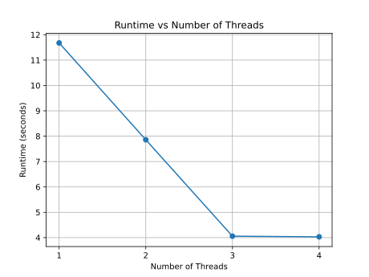

## Part 1
### a):
When running `hello_omp.c`, the program outputs a "Hello" message from each thread. It does appear that the output is accomplished out of the order of the rank of the thread.

This was my output:
```bash
usage: hello_omp <number threads>
Main program thread will now create all threads requested ...
Hello from OMP thread 0 of 4
Hello from OMP thread 3 of 4
Hello from OMP thread 1 of 4
Hello from OMP thread 2 of 4
All threads now done, main program proceeding to exi
```

With it going from 0, 3, 1, 2.

After reading the documentation, I went ahead and actually updated the function itself (I later realized I could've just put a look around the fuction instead).

I moved the `omp` `pragma` into the `Hello_threads` function. I changed the function to include a paramter for the `thread_count` so that each thread didn't have to pull the value. Then I created a `for` loop around the `printf`.

It tok me a while to learn, but I realized that I could create a "block" that `omp` could parallelize. I could do this by putting `{}` around whatever I wanted parallelized.

I decided to move the `my_rank` into the block so that each thread got its private rank. And, in addition to that, the `for` loop was also included with each thread having its own `i` value so that their iteration position wasn't changed by another thread.

This made it so that each thread would print out the same statement four times, individually. Which results in the program printing out 16 results.
### b):
After compiling dct2.c and running it, it runs for a little while and then terminates with no output.

When I used the `bash` `time` function, I timed the function to take, this was the output:
```bash
real    0m11.704s
user    0m11.700s
sys     0m0.001s
```

In reading the comments in `dct2.c` it seems that 3 frames are being processed based on this segment of code and comments:
```c
// E.g. Since video is most often 30 Hz, or 30 frames/sec, 30 iterations is therefor like 1 second of video.
//      Adjust the iterations as is reasonable for your system!
//
#define MAX_ITERATIONS (3)
```

With this information we have 3 frames and 11.704 seconds of the program running.

```python
time_per_frame = 11.704 / 3
print(time_per_frame)
```

With the result being around $3.9$ s/frame.

### c):
After compiling `ompdct2` and running with the `time` bash function, the results were:
```python
time_per_frame = 4.253 / 3
print(time_per_frame)
```

With the result being around $1.42$ s/frame

Now I'll do a calculation for how much the speedup was:
```python
time_per_frame_non_omp = 11.704 / 3
time_per_frame_omp = 4.253 / 3
print(time_per_frame_non_omp / time_per_frame_omp)
```

The speed-up with `omp` is $2.75 \times$ over not using `omp`.

### d):
- 1 thread:
    - $11.677$s
- 2 threads:
    - $7.859$s
- 3 threads:
    - $4.057$s
- 4 threads:
    - $4.031$s

Here's a graph of the speed-up:


### e):
The parallel portion of the code is everything in the `for` loop that comes just after the `pragma` in the `main` function within `ompdct2.c`. Everything else in the program is sequential.

This `for` loop composes a large portion of the program. It has other `for` loops within it and the `dct` and `idct` functions. By Ahmdal's law, this means that, theoretically, because most of the time of the code is spend on the parallelized portion, the program, overall, will completed much quicker.

Determining exactly how much time is spent on the parallelized portion would basically result in it being equal to the time it takes to complete the whole of the program.

## Part 2
### a):
#### sharpen_grid.c
For the `sharpen_grid.c` program, I didn't make any changes to it and used the default `900` iterations for sharpening the image and got `43.815142 FPS`.

The output looked a little weird to me when I opened it with an image viewer. So I tried to lower the iterations to `20` iterations, but it still came out looking weird. From `20` iterations I got `44.310001 FPS`.
#### shared.c
For the non-omp implementation, I got a result of `7.709192 FPS` for `90` iterations.

